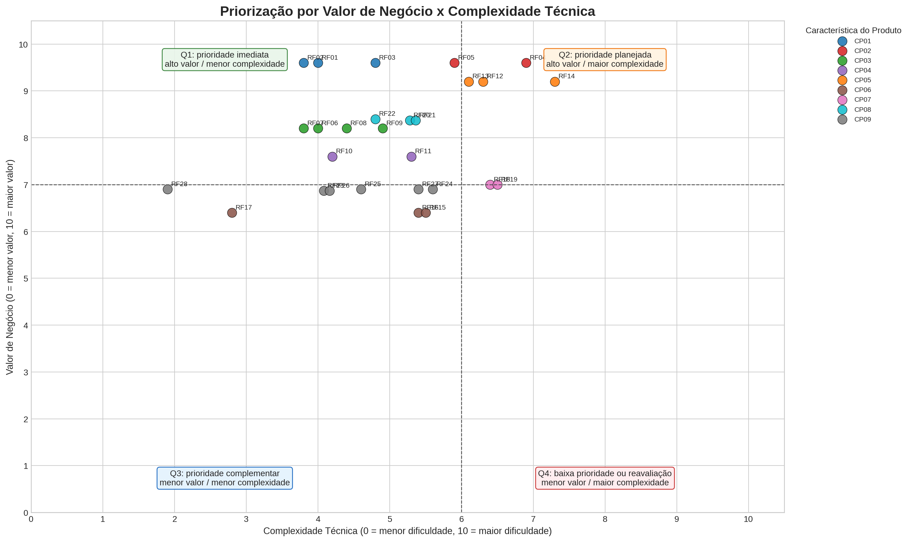

# Priorização por Valor de Negócio e Complexidade Técnica

Esta página apresenta a priorização do backlog a partir de uma matriz quantitativa de **Valor de Negócio x Complexidade Técnica**. A ordem de prioridade nasce diretamente do posicionamento dos requisitos no gráfico, considerando o quadrante em que cada item aparece e, como critério secundário de desempate, o índice calculado pela própria matriz.

A abordagem mantém a rastreabilidade com a [Matriz de Rastreabilidade](../rastreabilidade/matriz-rastrea.md), os [Requisitos Funcionais](requisitos-funcionais.md), os [Requisitos Não Funcionais](requisitos-nao-funcionais.md) e a [Visão do Produto](../visao-produto-projeto/visao-produto.md). Como cada requisito funcional está ligado a uma característica do produto, o **valor de negócio do requisito** é herdado da sua respectiva **Característica do Produto (CP)**.

## Regra de Valor de Negócio das Características

O valor de negócio foi atribuído às características do produto em escala de **0 a 10**. A pontuação final resulta de uma **média ponderada** de quatro critérios, sendo que tais critérios foram respondidos por representantes dos stakeholders.

| Critério | Peso | Interpretação |
|---|:---:|---|
| **Dor central atendida** | 35% | Mede o quanto a característica atua sobre dores centrais do produto, como evasão, assiduidade, acolhimento, engajamento ou decisão pedagógica. |
| **Impacto em stakeholders** | 25% | Mede se a característica gera valor para múltiplos atores, como aprendizes, instrutores, orientadores e coordenação. |
| **Frequência de uso** | 20% | Mede se a característica tende a ser usada de forma recorrente na rotina do produto. |
| **Diferencial/MVP** | 20% | Mede se a característica é estratégica para o MVP ou para demonstrar o diferencial do produto. |

**Fórmula utilizada:** Valor de Negócio da CP = (Dor Central × 0,35) + (Impacto em Stakeholders × 0,25) + (Frequência de Uso × 0,20) + (Diferencial/MVP × 0,20).

| CP   | Característica do Produto                                 | OE   |   Dor Central (0-10) |   Impacto em Stakeholders (0-10) |   Frequência de Uso (0-10) |   Diferencial/MVP (0-10) |   Valor de Negócio (0-10) | Justificativa                                                                                       |
|:-----|:----------------------------------------------------------|:-----|---------------------:|---------------------------------:|---------------------------:|-------------------------:|--------------------------:|:----------------------------------------------------------------------------------------------------|
| CP01 | Gestão de Frequência                                      | OE01 |                   10 |                                9 |                         10 |                        9 |                       9.6 | Frequência é entrada básica para acompanhar assiduidade e permanência dos aprendizes.               |
| CP02 | Monitoramento de Risco de Evasão e Intervenção Pedagógica | OE01 |                   10 |                               10 |                          8 |                       10 |                       9.6 | Atua diretamente na prevenção de evasão e no registro de intervenções pedagógicas.                  |
| CP03 | Gestão de Desafios e Atividades Formativas                | OE02 |                    8 |                                8 |                          9 |                        8 |                       8.2 | Sustenta evidências de aprendizagem, participação e acompanhamento formativo.                       |
| CP04 | Reconhecimento, Evolução e Engajamento                    | OE02 |                    7 |                                8 |                          8 |                        8 |                       7.6 | Apoia motivação, progresso e percepção de evolução do aprendiz.                                     |
| CP05 | Canal de Escuta e Relatos                                 | OE03 |                   10 |                                9 |                          7 |                       10 |                       9.2 | Permite acolhimento e identificação de situações sensíveis que exigem intervenção.                  |
| CP06 | Comunicação Direta e Comunicados                          | OE03 |                    6 |                                7 |                          8 |                        5 |                       6.4 | Melhora a comunicação institucional, mas é menos diferencial que escuta, permanência e indicadores. |
| CP07 | Avaliação de Desempenho 360 Graus                         | OE04 |                    7 |                                8 |                          5 |                        8 |                       7   | Gera avaliação formativa ampla, embora com menor frequência de uso cotidiano.                       |
| CP08 | Painéis e Relatórios Educacionais                         | OE04 |                    9 |                                9 |                          6 |                        9 |                       8.4 | Apoia decisão pedagógica, gestão por indicadores e acompanhamento institucional.                    |
| CP09 | Administração de Usuários, Turmas e Estágios              | OE05 |                    6 |                                8 |                          9 |                        5 |                       6.9 | Viabiliza a operação do sistema, mas não representa o principal diferencial pedagógico.             |
| CP10 | Qualidade, Segurança, Privacidade e Sustentação Técnica   | OE06 |                    9 |                                9 |                          5 |                        9 |                       8.2 | Garante confiança, privacidade, segurança e viabilidade operacional da plataforma.                  |

## Regra de Complexidade Técnica dos Requisitos

A complexidade técnica foi calculada para cada requisito funcional em escala de **0 a 10**. Cada critério também recebe uma nota de **0 a 10**, e a nota final é uma média ponderada. Esse modelo torna a análise mais prática para o grupo, pois cada item pode ser avaliado com uma escala comum e mais familiar.

| Critério | Peso | Interpretação |
|---|:---:|---|
| **Interface/CRUD** | 20% | Indica necessidade de tela, formulário, cadastro, edição ou ação operacional direta. |
| **Regra de negócio** | 25% | Indica existência de validações, regras pedagógicas, vínculos ou lógica além de uma consulta simples. |
| **Dados sensíveis/perfis** | 20% | Indica tratamento de perfis, permissões, relatos, avaliações ou dados com maior cuidado de privacidade. |
| **Consulta/processamento/relatório** | 25% | Indica necessidade de filtros, agregações, cálculo, histórico, dashboard, relatório ou exportação. |
| **Tempo real/integração** | 10% | Indica necessidade de comunicação instantânea, atualização em tempo real ou integração técnica mais complexa. |

**Fórmula utilizada:** Complexidade Técnica do Requisito = (Interface/CRUD × 0,20) + (Regra de Negócio × 0,25) + (Dados Sensíveis/Perfis × 0,20) + (Consulta/Processamento/Relatório × 0,25) + (Tempo Real/Integração × 0,10).

## Regra de Priorização Derivada do Gráfico

A priorização é derivada diretamente dos quadrantes do gráfico. O corte adotado considera **valor alto** quando o requisito possui valor de negócio maior ou igual a **7,0**, e **complexidade alta** quando possui complexidade técnica maior ou igual a **6,0**.

| Ordem | Quadrante | Critério | Decisão de Priorização |
|:---:|---|---|---|
| **1** | **Q1 — Prioridade imediata** | Valor ≥ 7,0 e Complexidade < 6,0 | Deve ser priorizado primeiro, pois entrega alto valor com menor esforço relativo. |
| **2** | **Q2 — Prioridade planejada** | Valor ≥ 7,0 e Complexidade ≥ 6,0 | Deve ser planejado em incrementos, pois é estratégico, mas tecnicamente mais difícil. |
| **3** | **Q3 — Prioridade complementar** | Valor < 7,0 e Complexidade < 6,0 | Pode ser implementado como complemento, suporte operacional ou melhoria de experiência. |
| **4** | **Q4 — Baixa prioridade ou reavaliação** | Valor < 7,0 e Complexidade ≥ 6,0 | Deve ser simplificado, adiado ou reavaliado, pois exige esforço alto para o valor atual. |

Quando dois requisitos aparecem no mesmo quadrante, o desempate utiliza o **Índice da Matriz**, calculado pela fórmula `Valor de Negócio - (Complexidade Técnica × 0,35)`. Esse índice apenas ordena itens dentro do mesmo quadrante; portanto, a priorização continua sendo resultado do próprio gráfico.

## Resultado Calculado por Requisito

|   Prioridade | RF   | CP   | Requisito Funcional                                        |   Valor de Negócio (0-10) |   Interface/CRUD (0-10) |   Regra de Negócio (0-10) |   Dados Sensíveis/Perfis (0-10) |   Consulta/Processamento/Relatório (0-10) |   Tempo Real/Integração (0-10) |   Complexidade Técnica (0-10) |   Índice da Matriz | Quadrante                    |
|-------------:|:-----|:-----|:-----------------------------------------------------------|--------------------------:|------------------------:|--------------------------:|--------------------------------:|------------------------------------------:|-------------------------------:|------------------------------:|-------------------:|:-----------------------------|
|            1 | RF02 | CP01 | Consultar histórico de frequência                          |                       9.6 |                       5 |                         3 |                               2 |                                         6 |                              1 |                           3.8 |               8.27 | Q1 — Prioridade imediata     |
|            2 | RF01 | CP01 | Registrar frequência diária                                |                       9.6 |                       6 |                         7 |                               2 |                                         2 |                              1 |                           4   |               8.2  | Q1 — Prioridade imediata     |
|            3 | RF03 | CP01 | Calcular indicadores de assiduidade                        |                       9.6 |                       3 |                         7 |                               2 |                                         8 |                              1 |                           4.8 |               7.92 | Q1 — Prioridade imediata     |
|            4 | RF05 | CP02 | Registrar ações de intervenção pedagógica                  |                       9.6 |                       6 |                         8 |                               8 |                                         4 |                              1 |                           5.9 |               7.54 | Q1 — Prioridade imediata     |
|            5 | RF07 | CP03 | Consultar desafios e atividades atribuídas                 |                       8.2 |                       5 |                         3 |                               2 |                                         6 |                              1 |                           3.8 |               6.87 | Q1 — Prioridade imediata     |
|            6 | RF06 | CP03 | Cadastrar desafios e atividades formativas                 |                       8.2 |                       6 |                         6 |                               2 |                                         3 |                              1 |                           4   |               6.8  | Q1 — Prioridade imediata     |
|            7 | RF22 | CP08 | Exportar relatórios educacionais gerenciais                |                       8.4 |                       5 |                         4 |                               4 |                                         7 |                              2 |                           4.8 |               6.72 | Q1 — Prioridade imediata     |
|            8 | RF08 | CP03 | Registrar entrega de desafios e atividades                 |                       8.2 |                       6 |                         6 |                               3 |                                         4 |                              1 |                           4.4 |               6.66 | Q1 — Prioridade imediata     |
|            9 | RF20 | CP08 | Consultar painel de indicadores educacionais               |                       8.4 |                       6 |                         5 |                               4 |                                         8 |                              1 |                           5.4 |               6.51 | Q1 — Prioridade imediata     |
|           10 | RF21 | CP08 | Gerar relatórios educacionais                              |                       8.4 |                       4 |                         7 |                               4 |                                         8 |                              1 |                           5.4 |               6.51 | Q1 — Prioridade imediata     |
|           11 | RF09 | CP03 | Avaliar entregas de desafios e atividades                  |                       8.2 |                       6 |                         7 |                               3 |                                         5 |                              1 |                           4.9 |               6.48 | Q1 — Prioridade imediata     |
|           12 | RF10 | CP04 | Consultar conquistas e evolução                            |                       7.6 |                       5 |                         4 |                               2 |                                         7 |                              1 |                           4.2 |               6.13 | Q1 — Prioridade imediata     |
|           13 | RF11 | CP04 | Gerar indicadores de engajamento                           |                       7.6 |                       3 |                         8 |                               3 |                                         8 |                              1 |                           5.3 |               5.74 | Q1 — Prioridade imediata     |
|           14 | RF04 | CP02 | Identificar padrões de risco de evasão                     |                       9.6 |                       3 |                         9 |                               8 |                                         9 |                              2 |                           6.9 |               7.18 | Q2 — Prioridade planejada    |
|           15 | RF13 | CP05 | Consultar relatos recebidos                                |                       9.2 |                       5 |                         5 |                              10 |                                         7 |                              1 |                           6.1 |               7.06 | Q2 — Prioridade planejada    |
|           16 | RF12 | CP05 | Registrar relatos do aprendiz                              |                       9.2 |                       6 |                         8 |                              10 |                                         4 |                              1 |                           6.3 |               6.99 | Q2 — Prioridade planejada    |
|           17 | RF14 | CP05 | Categorizar relatos do aprendiz                            |                       9.2 |                       6 |                         8 |                              10 |                                         8 |                              1 |                           7.3 |               6.64 | Q2 — Prioridade planejada    |
|           18 | RF18 | CP07 | Registrar avaliação de desempenho 360 graus                |                       7   |                       7 |                         8 |                               8 |                                         5 |                              1 |                           6.4 |               4.76 | Q2 — Prioridade planejada    |
|           19 | RF19 | CP07 | Gerar relatório de avaliação 360 graus                     |                       7   |                       4 |                         8 |                               8 |                                         8 |                              1 |                           6.5 |               4.72 | Q2 — Prioridade planejada    |
|           20 | RF28 | CP09 | Consultar seção de dúvidas frequentes e orientações de uso |                       6.9 |                       3 |                         2 |                               1 |                                         2 |                              1 |                           1.9 |               6.24 | Q3 — Prioridade complementar |
|           21 | RF23 | CP09 | Cadastrar perfil de usuário                                |                       6.9 |                       6 |                         4 |                               7 |                                         2 |                              1 |                           4.2 |               5.43 | Q3 — Prioridade complementar |
|           22 | RF26 | CP09 | Cadastrar turmas e estágios de aprendizagem                |                       6.9 |                       6 |                         6 |                               3 |                                         3 |                              1 |                           4.2 |               5.43 | Q3 — Prioridade complementar |
|           23 | RF17 | CP06 | Publicar comunicados                                       |                       6.4 |                       5 |                         3 |                               2 |                                         2 |                              1 |                           2.8 |               5.42 | Q3 — Prioridade complementar |
|           24 | RF25 | CP09 | Autenticar usuário na plataforma                           |                       6.9 |                       5 |                         5 |                               8 |                                         2 |                              2 |                           4.6 |               5.29 | Q3 — Prioridade complementar |
|           25 | RF27 | CP09 | Vincular aprendiz a turmas e estágios de aprendizagem      |                       6.9 |                       6 |                         7 |                               7 |                                         4 |                              1 |                           5.4 |               5.01 | Q3 — Prioridade complementar |
|           26 | RF24 | CP09 | Gerenciar perfil de usuário                                |                       6.9 |                       7 |                         7 |                               8 |                                         3 |                              1 |                           5.6 |               4.94 | Q3 — Prioridade complementar |
|           27 | RF16 | CP06 | Consultar histórico de mensagens do canal direto           |                       6.4 |                       5 |                         4 |                               7 |                                         7 |                              2 |                           5.4 |               4.51 | Q3 — Prioridade complementar |
|           28 | RF15 | CP06 | Enviar mensagem instantânea em canal de comunicação direto |                       6.4 |                       7 |                         4 |                               7 |                                         3 |                              9 |                           5.5 |               4.48 | Q3 — Prioridade complementar |

## Gráfico de Priorização

O gráfico posiciona cada requisito funcional conforme seu **valor de negócio**, herdado da característica de produto, e sua **complexidade técnica**, calculada pelos critérios objetivos apresentados. A escala final de 0 a 10, com médias ponderadas e uma casa decimal, aumenta a separação visual entre os pontos e reduz a concentração excessiva de requisitos no mesmo lugar.

 Imagem gerada pela equipe 

## Síntese por Quadrante

| Quadrante                    | RF                                                                           |
|:-----------------------------|:-----------------------------------------------------------------------------|
| Q1 — Prioridade imediata     | RF02, RF01, RF03, RF05, RF07, RF06, RF22, RF08, RF20, RF21, RF09, RF10, RF11 |
| Q2 — Prioridade planejada    | RF04, RF13, RF12, RF14, RF18, RF19                                           |
| Q3 — Prioridade complementar | RF28, RF23, RF26, RF17, RF25, RF27, RF24, RF16, RF15                         |
| Q4 — Baixa prioridade  | ---                         |

## Histórico de versões

| Versão | Data | Descrição |
|:---:|:---:|---|
| 1.0 | 18/05 | Versão inicial do documento |

