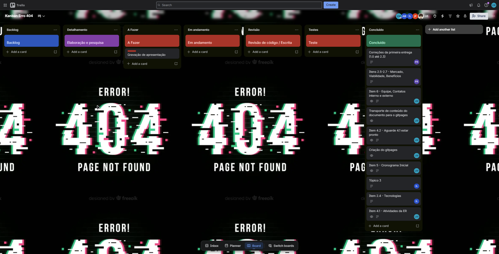

# Processo de Desenvolvimento de Software

## 3. Estratégias de Engenharia de Software

### 3.1 Estratégia Priorizada

| Campo | Decisão |
|-------|---------|
| **Abordagem** | Híbrida |
| **Ciclo de Vida** | Iterativo e Incremental |
| **Processo** | DAD (Disciplined Agile Delivery) baseado em Kanban |

A abordagem híbrida foi escolhida por combinar a disciplina de planejamento de processos formais com a flexibilidade das metodologias ágeis, adequando-se ao contexto acadêmico da disciplina e ao ritmo de desenvolvimento iterativo necessário para validar continuamente a solução com o cliente.

### 3.2 Quadro Comparativo

| Critério | Scrum (Ágil) | DAD + Kanban (Híbrido) |
|----------|:---:|:---:|
| **Estrutura de papéis** | Papéis fixos | Papéis flexíveis |
| **Cerimônias obrigatórias** | Sprint Planning, Daily, Review, Retro | Reuniões conforme necessidade |
| **Ciclos de entrega** | Sprints fixas (1–4 semanas) | Fluxo contínuo incremental |
| **Gestão do trabalho** | Backlog + Sprint Backlog | Quadro Kanban com WIP limits |
| **Documentação** | Mínima | Equilibrada |
| **Adaptação ao contexto acadêmico** | Moderada | Alta |
| **Adequação a equipes pequenas** | Moderada | Alta |

### 3.3 Justificativa

A escolha pelo **DAD baseado em Kanban** fundamenta-se em três argumentos principais: o tamanho e perfil da equipe (menor sobrecarga de cerimônias), a natureza do problema (ciclos curtos de feedback para validar gamificação) e a compatibilidade com o DAD (framework escalável e adaptável que mantém disciplina de processo sem abrir mão da agilidade).

### 3.4 Quadro Kanban

Abaixo se apresenta o template de Kanban que está sendo utilizado pela equipe como definido no processo de software.

---

## 4. Engenharia de Requisitos

### 4.1 Atividades e Técnicas de ER

=== "Elicitação e Descoberta"

    **Entrevistas semiestruturadas com o cliente:** Reuniões periódicas com o cliente e representante para levantar necessidades, expectativas e restrições do negócio de forma aprofundada.

    **Questionários com jovens aprendizes:** Formulários aplicados ao público-alvo para compreender suas dores, expectativas em relação à gamificação e barreiras de engajamento.

=== "Análise e Consenso"

    **Workshops de priorização com o cliente:** Sessões colaborativas para alinhar o escopo do MVP, definindo quais características têm maior impacto sobre o problema de evasão.

    **Análise de documentos existentes:** Revisão de registros de frequência, relatórios de evasão e materiais institucionais para embasar os requisitos com dados reais.

=== "Declaração"

    **User Stories:** Descrição dos requisitos funcionais no formato "Como [persona], quero [ação], para que [benefício]", priorizadas no backlog conforme o modelo MoSCoW.

    **Requisitos Não Funcionais com URPS+:** Classificação e documentação dos requisitos de qualidade do sistema.

=== "Representação"

    **Casos de Uso:** Diagramas e descrições textuais dos principais fluxos de interação entre os atores e o sistema.

    **Protótipos de baixa fidelidade:** Wireframes das telas principais para validar a experiência do usuário antes do desenvolvimento.

=== "Verificação e Validação"

    **Revisão por pares:** Inspeção dos artefatos pelos membros da equipe para identificar inconsistências e lacunas.

    **Validação com o cliente:** Apresentação dos artefatos ao cliente para confirmação de que os requisitos refletem corretamente as necessidades do negócio.

=== "Organização e Atualização"

    **Backlog de Produto no GitHub Projects:** Centralização e rastreabilidade de todos os requisitos em um quadro Kanban, permitindo visibilidade do status de cada item.

### 4.2 Mapeamento ER × Processo

| Fase do Processo | Atividade ER | Técnica | Resultado Esperado |
|---|---|---|---|
| **Inception** | Elicitação e Descoberta | Entrevistas semiestruturadas | Lista inicial de necessidades |
| **Inception** | Análise e Consenso | MoSCoW + análise de documentos | Escopo preliminar do MVP |
| **Inception** | Declaração de Requisitos | User Stories + URPS+ | Backlog inicial |
| **Construction** | Representação | Wireframes + Casos de Uso | Protótipos validados |
| **Construction** | Verificação e Validação | Inspeção + demo ao cliente | Requisitos confirmados |
| **Construction** | Organização e Atualização | GitHub Projects (Kanban) | Backlog atualizado |
| **Transition** | Verificação e Validação | Testes com usuários reais | MVP validado |

## Histórico de versões

| Versão | Data | Descrição | 
|:--------:|:-------:|:-------------------:|
| 1.0 | 13/04 | Versão inicial do documento|